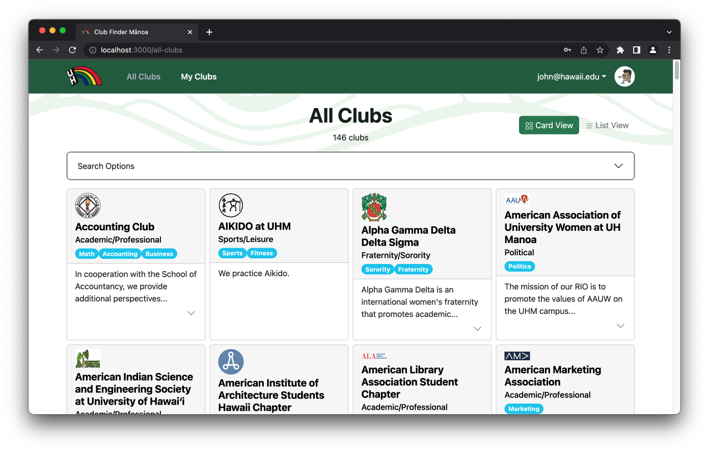

# **Club Finder Manoa**

## **Table of contents**

* [Overview](#overview)
* [User Guide](#user-guide)
* [Developer Guide](#developer-guide)
* [Development History](#development-history)
* [Deployment](#deployment)
* [Developer Contact](#developer-contact)

## **Overview**
<!-- Summarizes what the system does and what makes it special and different from other related applications -->

*The problem*: UH Manoa has over 200 Registered Independent Organizations, plus many more that do not have this “official” status but are nonetheless active organizations. Unfortunately, there is no easy way for students to learn what student clubs (both registered and unregistered) exist, what they do, and how to get further involved.

*The solution*: The Club Finder Manoa application will provide a centralized directory for UH Manoa student clubs. UH Manoa students can login to browse a well organized directory of all current student clubs, with brief descriptions, meeting times and locations, URLs to their websites (if any), contact information for officers, and a few select photos.

Club Finder Manoa has three user roles, all of whom login with their UH ID:
  - Regular users browse the directory and find clubs based on their interests
  - Club Admins have the ability to edit the data associated with their club
  - Super Admins make sure site content is appropriate and grant “club admin” privileges to selected users

The site will allow a user to browse the list of clubs in alphabetical order as well as filter by interest. For example, “athletic” clubs, “art” clubs, “music” clubs, etc. A club can belong to multiple interest areas, making it easier for users to find.

Users can specify interest areas, and be notified when a new club is created matching that interest area (or an existing club adds that interest area).

Admins can monitor the site for inappropriate content, create and edit clubs, and create new categories of interests.

## **User Guide**
<!-- Provide at least one screen shot of every page. This section should provide enough detail for a user to get up and running with your system (you can provide further help within the application itself) -->

This section provides a walkthrough of the Club Finder Manoa user interface and its capabilities.

### **Landing Page**

The landing page is presented to users when they visit the top-level URL to the site.

<div class="col d-flex justify-content-center">
  
</div>

### **Sign In / Sign Up**

Club Finder Manoa requires students to log in to access club information. Users are required to have an @hawaii.edu email to create an account. To log in, click "Login" in the upper right corner of the page. If you are a returning user, select "Sign In" and the sign in page will be displayed:

<div class="col d-flex justify-content-center">
  
</div>

Alternatively, if you are a new user, select "Sign up" and you will be directed to a page where you can create a new account:

<div class="col d-flex justify-content-center">
  
</div>

### **My Clubs Page**

After logging in, you are taken to the "My Clubs" page. This page displays all the clubs that the user has marked as saved:

<div class="col d-flex justify-content-center">
  
</div>

### **All Clubs Page**

Selecting "All Clubs" in the navbar will direct you to a page displaying a list of all of the clubs stored in the application's database:

<div class="col d-flex justify-content-center">
  
</div>

### **Club Page**

You can select a club from the list to see a specific club's page. This page displays more information about the club, including contact information, meeting times, and upcoming events:

<div class="col d-flex justify-content-center">
  
</div>

### **Profile Page**

Users can view their profile and edit profile information by selecting "Profile" in the navbar:

<div class="col d-flex justify-content-center">
  
</div>

### **Admin Page**

Site administrators have access to a special admin page where they can edit users and change a user's "Club Admin" status.

<div class="col d-flex justify-content-center">
  
</div>

<!--
## **Community Feedback**
<!-- Provides information obtained from users about the system -->

## **Developer Guide**
<!-- How to download, install, and run the system locally, as well as how to deploy it -->

This section provides information of interest to Meteor developers wishing to use this code base as a basis for their own development tasks.

### **Installation**

First, [install Meteor](https://www.meteor.com/install).

Second, visit the [Club Finder Manoa application github page](https://github.com/club-finder-manoa), and click the "Use this template" button to create your own repository initialized with a copy of this application. Alternatively, you can download the sources as a zip file or make a fork of the repo.  However you do it, download a copy of the repo to your local computer.

Third, cd into the club-finder-manoa/app directory and install libraries with:

```
$ meteor npm install
```

Fourth, run the system with:

```
$ meteor npm run start
```

If all goes well, the application will appear at [http://localhost:3000](http://localhost:3000).

### **Application Design**

Club Finder Manoa is based upon [bowfolios](https://bowfolios.github.io/).

## **Initialization**

The [config](https://github.com/club-finder-manoa/club-finder-manoa/tree/main/config) directory is intended to hold settings files.  The repository contains one file: [config/settings.development.json](https://github.com/bowfolios/bowfolios/blob/main/config/settings.development.json).

This file contains default definitions for Clubs and Users and the relationship between them.

The settings.development.json file contains a field called "loadAssetsFile". It is set to true, which means that the data in the file app/private/clubs.json will also be loaded. If you change this value to false, the default clubs will not be loaded.


### **Quality Assurance**

#### **ESLint**

Club Finder Manoa includes a [.eslintrc](https://github.com/bowfolios/bowfolios/blob/main/app/.eslintrc) file to define the coding style adhered to in this application. You can invoke ESLint from the command line as follows:

```
meteor npm run lint
```

Here is sample output indicating that no ESLint errors were detected:

```
$ meteor npm run lint

> meteor-application-template-react@ lint /Users/destyneefagaragan/Documents/GitHub/club-finder-manoa/app
> eslint --quiet --ext .jsx --ext .js ./imports && eslint --quiet --ext .js ./tests

$
```

ESLint should run without generating any errors.

It's significantly easier to do development with ESLint integrated directly into your IDE (such as IntelliJ).

#### **End to End Testing**

Club Finder Manoa uses [TestCafe](https://devexpress.github.io/testcafe/) to provide automated end-to-end testing.

The Club Finder Manoa end-to-end test code employs the page object model design pattern.  In the [club finder manoa tests/ directory](https://github.com/club-finder-manoa/club-finder-manoa/tree/main/app/tests), the file [tests.testcafe.js](https://github.com/bowfolios/bowfolios/blob/main/app/tests/tests.testcafe.js) contains the TestCafe test definitions. The remaining files in the directory contain "page object models" for the various pages in the system (i.e. Home, Landing, Interests, etc.) as well as one component (navbar). This organization makes the test code shorter, easier to understand, and easier to debug.

To run the end-to-end tests in development mode, you must first start up a BowFolios instance by invoking `meteor npm run start` in one console window.

Then, in another console window, start up the end-to-end tests with:

```
meteor npm run testcafe
```

You will see browser windows appear and disappear as the tests run.  If the tests finish successfully, you should see the following in your second console window:

```
$ meteor npm run testcafe

> meteor-application-template-react@ testcafe /Users/destyneefagaragan/Documents/GitHub/club-finder-manoa/app
> testcafe chrome tests/*.testcafe.js

 Running tests in:
 - Chrome 107.0.0.0 / Monterey 12

 Club Finder Manoa localhost test with default db
 ✓ Test that landing page shows up
 ✓ Test that signup page, then logout works
 ✓ Test that signin and signout work
 ✓ Test the All Clubs page
 ✓ Test the My Club page
 ✓ Test the Admin page


 9 passed (40s)

 $
```

You can also run the testcafe tests in "continuous integration mode".  This mode is appropriate when you want to run the tests using a continuous integration service like Jenkins, Semaphore, CircleCI, etc.  In this case, it is problematic to already have the server running in a separate console, and you cannot have the browser window appear and disappear.

To run the testcafe tests in continuous integration mode, first ensure that BowFolios is not running in any console.

Then, invoke `meteor npm run testcafe-ci`.  You will not see any windows appear.  When the tests finish, the console should look like this:

```
$ meteor npm run testcafe-ci

> meteor-application-template-react@ testcafe-ci /Users/destyneefagaragan/Documents/GitHub/club-finder-manoa/app
> testcafe chrome:headless tests/*.testcafe.js -q attemptLimit=5,successThreshold=2 --app "meteor npm run start"


 Running tests in:
 - Chrome 107.0.0.0 / Monterey 12

 Club Finder Manoa localhost test with default db
 ✓ Test that landing page shows up
 ✓ Test that signup page, then logout works
 ✓ Test that signin and signout work
 ✓ Test the All Clubs page
 ✓ Test the My Club page
 ✓ Test the Admin page


 9 passed (56s)

$
```

All the tests pass, but the first test is marked as "unstable". At the time of writing, TestCafe fails the first time it tries to run a test in this mode, but subsequent attempts run normally. To prevent the test run from failing due to this problem with TestCafe, we enable [testcafe quarantine mode](https://devexpress.github.io/testcafe/documentation/guides/basic-guides/run-tests.html#quarantine-mode).

The only impact of quarantine mode should be that the first test is marked as "unstable".

## **From mockup to production**

Club Finder Manoa is meant to illustrate the use of Meteor for developing an initial proof-of-concept prototype.  For a production application, several additional security-related changes must be implemented:

* Use of email-based password specification for users, and/or use of an alternative authentication mechanism.
* Use of https so that passwords are sent in encrypted format.
* Removal of the insecure package, and the addition of Meteor Methods to replace client-side DB updates.

(Note that these changes do not need to be implemented for ICS 314, although they are relatively straightforward to accomplish.)

## **Continuous Integration**

[](https://github.com/club-finder-manoa/club-finder-manoa/actions/workflows/ci.yml)

Club Finder Manoa uses [GitHub Actions](https://docs.github.com/en/free-pro-team@latest/actions) to automatically run ESLint and TestCafe each time a commit is made to the default branch.  You can see the results of all recent "workflows" at [https://github.com/club-finder-manoa/club-finder-manoa/actions](https://github.com/club-finder-manoa/club-finder-manoa/actions)

The workflow definition file is quite simple and is located at
[.github/workflows/ci.yml](https://github.com/club-finder-manoa/club-finder-manoa/actions/workflows/ci.yml).


## **Development History**
<!-- Explains the trajectory of development of the system: what was accomplished during each milestone. See the BowFolios system for details -->
- **[M1](https://github.com/orgs/club-finder-manoa/projects/1/views/1?layout=board)** (Milestone 1)
  - Completed mockups for major pages
  - Defined database schemas
  - Deployed to Digital Ocean

- **[M2](https://github.com/orgs/club-finder-manoa/projects/2)** (Milestone 2)
  - Integrate all mockup pages to deployed website
  - Refine database schema
  - Link pages to database

- **[M3](https://github.com/orgs/club-finder-manoa/projects/3)** (Milestone 3)
  - Incorporate a significant amount of “real” data into your system
  - Find at least five UH community members (not from ICS 314) to try out your system and provide feedback.
  - Implement acceptance testing

## **Deployment**
<!-- Section called Deployment containing a link to the deployed application running on Digital Ocean -->

[View Live Website](http://142.93.232.214/)

## **Developer Contact**
<!-- Explains who the developers of the system are and how to get in touch with them if you have comments or questions -->

Club Finder Manoa is designed, implemented, and maintained by:
- [Destynee Fagaragan](https://djaf6.github.io/)
- [Galen Chang](https://galenchang.github.io/)
- [Gwyneth Raquepo](https://graquepo.github.io/)
- [Jayson Iwanaka](https://jiwanaka.github.io/)
- [Robert Godfrey](https://robertgodfrey.github.io/)

[Team Contract](./team-contract.pdf)

For comments or questions, please contact us via our project's [GitHub](https://github.com/club-finder-manoa/club-finder-manoa).
