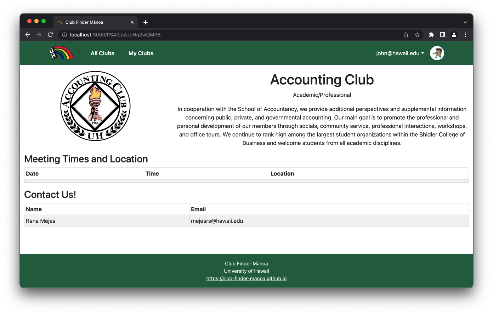

# **Club Finder Manoa**

## **Table of contents**

* [Overview](#overview)
* [Mockup Pages](#mockup-pages)
* [Development History](#development-history)
* [Developer Contact](#developer-contact)

## **Overview**
<!-- Summarizes what the system does and what makes it special and different from other related applications -->

*The problem*: UH Manoa has over 200 Registered Independent Organizations, plus many more that do not have this “official” status but are nonetheless active organizations. Unfortunately, there is no easy way for students to learn what student clubs (both registered and unregistered) exist, what they do, and how to get further involved.

*The solution*: The Club Finder Manoa application will provide a centralized directory for UH Manoa student clubs. UH Manoa students can login to browse a well organized directory of all current student clubs, with brief descriptions, meeting times and locations, URLs to their websites (if any), contact information for officers, and a few select photos.

Club Finder Manoa has three user roles, all of whom login with their UH ID:
  - Regular users browse the directory
  - Club Admins have the ability to edit the data associated with their club
  - Super Admins make sure site content is appropriate and grant “club admin” privileges to selected users

The site will allow a user to browse the list of clubs in alphabetical order as well as filter by interest. For example, “athletic” clubs, “art” clubs, “music” clubs, etc. A club can belong to multiple interest areas, making it easier for users to find.

Users can specify interest areas, and be notified when a new club is created matching that interest area (or an existing club adds that interest area).

Admins can monitor the site for inappropriate content, and create new categories of interests, capabilities, and goals.

## **Mockup Pages**
<!-- To be deleted once layouts added in 'User Guide' section -->

  
Landing page

  

  
All clubs page

  

  
Club details page

  

<!--
## **User Guide**
<!-- Provide at least one screen shot of every page. This section should provide enough detail for a user to get up and running with your system (you can provide further help within the application itself)

## **Community Feedback**
<!-- Provides information obtained from users about the system

## **Developer Guide**
<!-- How to download, install, and run the system locally, as well as how to deploy it -->

## **Development History**
<!-- Explains the trajectory of development of the system: what was accomplished during each milestone. See the BowFolios system for details -->
- **[M1](https://github.com/orgs/club-finder-manoa/projects/1/views/1?layout=board)** (Milestone 1)
  - Complete mockups for major pages
  - Define database schema
  - Deploy to Digital Ocean
- **[M2](https://github.com/orgs/club-finder-manoa/projects/2)** (Milestone 2)
  - Integrate all mockup pages to deployed website
  - Refine database schema
  - Link pages to database

## **Deployment**
<!-- Section called Deployment containing a link to the deployed application running on Digital Ocean -->

[View Website](http://142.93.232.214/)

## **Developer Contact**
<!-- Explains who the developers of the system are and how to get in touch with them if you have comments or questions -->

Club Finder Manoa is designed, implemented, and maintained by:
- [Destynee Fagaragan](https://djaf6.github.io/)
- [Galen Chang](https://galenchang.github.io/)
- [Gwyneth Raquepo](https://graquepo.github.io/)
- [Jayson Iwanaka](https://jiwanaka.github.io/)
- [Robert Godfrey](https://robertgodfrey.github.io/)

[Team Contract](./team-contract.pdf)

For comments or questions, please contact us via our project's [GitHub](https://github.com/club-finder-manoa/club-finder-manoa).
